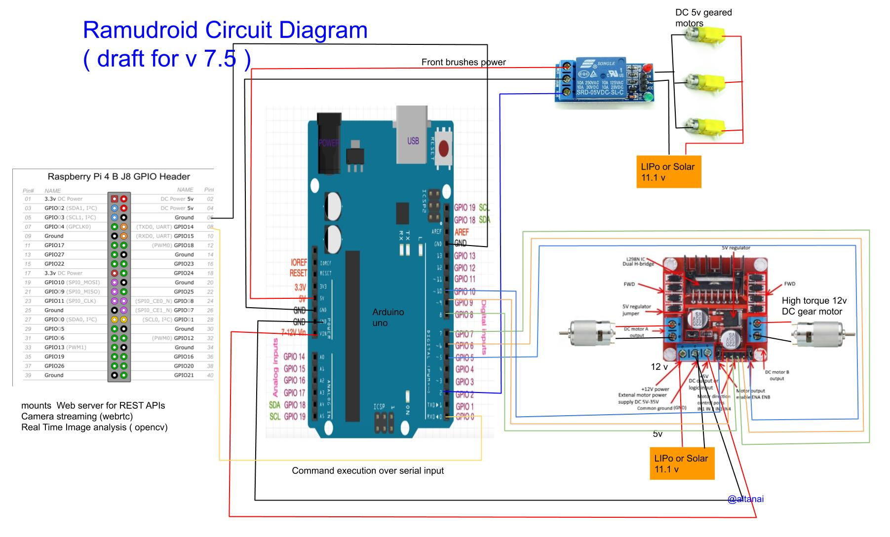

Ramudroid is a bot to clean roads and outdoor environments. It is battery-powered. For brains, there's a Raspberry Pi on board. It's got wireless connectivity. There's a camera for real-time image sensing of the environment

[](https://gitter.im/altanai/m2mcommunication?utm_source=badge&utm_medium=badge&utm_campaign=pr-badge&utm_content=badge)

## Ramudroid's Hardware 



List of components 

### Processing and MicroController

**Raspberry Pi 3B+/4 as Central Processing Unit**
- runs webservices to receive remote navigation command
- runs uv4l streaming server for webrtc 
- opencv remote object identification 

**Arduino Uno as Microcontroller**
- receives commands from Rpi on serial interface
- control motors for movement and cleaning

### Driving Unit 

**Pi NoIR Camera V2**
Object and obstacle detection , uses Sony IMX219 8-megapixel sensor
accessed through the MMAL and V4L APIs,

**motor driver**
L298 Motor Driver 

**power**
Lipo batteru 11.1 V or Solar Panel connection 12 V

### Cleaning Unit 

**brushes motor**
3 x 5V DC gear motor  

**relay**
5V single channel relay

**power**
Lipo batteru 11.1 V or Solar Panel connection 12 V


#### IR sensor to detect if garbage collectrion bin/tray is full
infrared radiation can be found between the visible and microwave regions, wavelengths between 0.75 and 1000µm.

## Software 

Following are the modular components of the project :

### 1. m2m-communication communication 

Communication between the web client , mobile client , cloud server and robot's  core unit is primarily on REST API's.
Communication techniques used in the project are as follows 

For external world 
- Wifi
- BLE

For intercomponents 
- GPIO
- UART 
- I2C

### 2. Computer Vision, object tracking, realtime video analysis

To effectively limit the usuage of power on frontal clenaing brushes, it is crucial to target garbage/litter and active the motors only when suited target is found. 
Implemnting edge image analysis based on opencv filters and classifiers to detect garbage

Ref : https://github.com/altanai/computervision
https://github.com/altanai/opencv_extra

### 3. Live streaming and augmented reality


### 4. Robot's core control unit


Connecting Motors, drivers , sensors , batteries etc and controlling operation 

GPIO access library written in C for the BCM2835 used in the Raspberry Pi
```
git clone git://git.drogon.net/wiringPi
cd wiringPi
git pull origin
cd wiringPi
./build
gpio -v
gpio readall
```

### 5. Web Console for Ramudroid


## Author 
Altanai https://www.linkedin.com/in/altanai

**Contributing guidelines**
https://github.com/altanai/Ramudroid/wiki/Contributing-Guidelines

**References**
Hackaday : https://hackaday.io/project/11201-ramudroid
JigsawAcdemy : https://youtu.be/49dtFYhxmjc

**Version5**
Ramudroid v5 https://altanaitelecom.wordpress.com/?s=Bot+to+clean+roads+and+outdoors
Ramudorid v7 Surajdroid ( Ramudroid v7 Solar Powered ) - https://telecom.altanai.com/2018/12/09/surajdroid-ramudroid-v7-solar-powered/

**License**
GPL